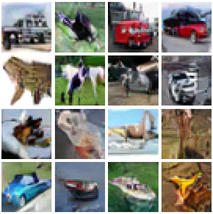
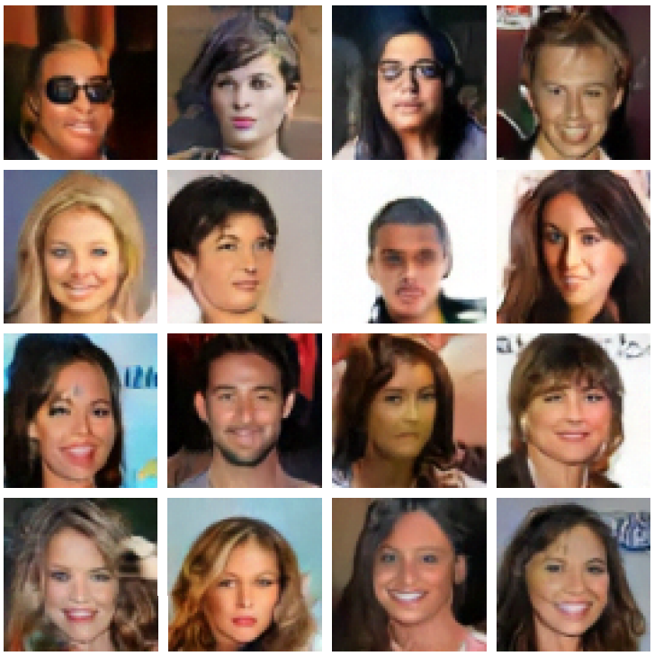
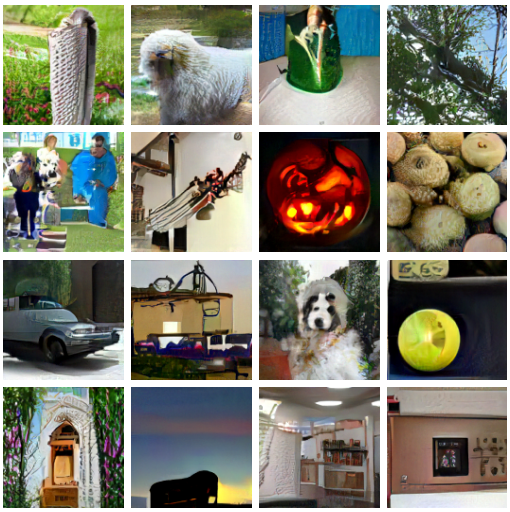
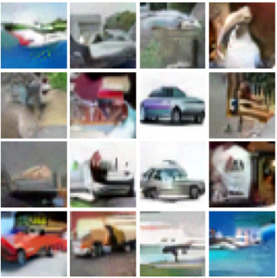
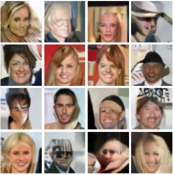
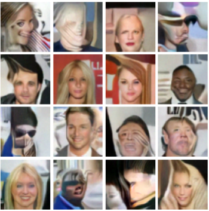
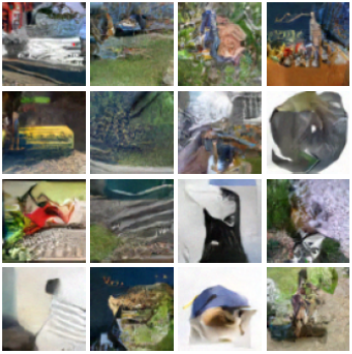
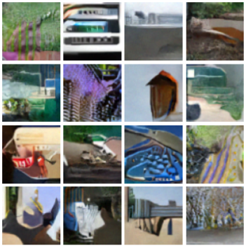

# EBM Life Cycle

This repo will replicate the synthesis, defense, and density modeling experiments from our work 

*EBM Life Cycle: MCMC Strategies for Synthesis, Defense, and Density Modeling*  
Mitch Hill\*, Jonathan Mitchell\*, Chu Chen, Yuan Du, Mubarak Shah, Song-Chun Zhu (\*eq. contrib.)
https://arxiv.org/pdf/2205.12243.pdf

All experiments use Tensorflow 2.

## Setup

For CPU or GPU computing, run:

```bash setup.sh```

For TPU computing, run:

```bash setup_tpu.sh```

Both should be run from inside of the ```ebm-life-cycle``` folder.

## Running Files

To run an experiment, you will need an executable file ```train.py```, ```train_longrun.py```, ```fid.py```, or ```attack.py```, along with a config file from one of the folders ```configs```, ```configs_lr```, ```configs_attack```, or ```configs_fid```.  From outside of the ```ebm-life-cycle``` folder, you can run the experiment using:

```python3 ebm-life-cycle/FILE_NAME.py CONFIG_FOLDER/CONFIG_FILE.py```

For example, to run a shortrun synthesis experiment on CIFAR-10, you can use the command:

```python3 ebm-life-cycle/train.py configs/cifar10_nonconv_sngan.py```

## Shortrun Experiments

The shortun learning experiments are geared toward image synthesis. They can be implemented using the executable ```train.py``` and either ``cifar10_nonconv_resnet.py``, ```celeb_a_nonconv_resnet.py```, or ```imagenet_nonconv_resnet.py``` in the ```configs``` folder. For to get optimal results, one might need to evaluate a range of different model checkpoints. We typically find the best FID for CIFAR-10 at about 25K to 50K model updates, best FID for Celeb A at about 40K to 60K model updates, and the best FID for ImageNet at about 220K to 240K model updates.

The expected best FID for each experiment is recorded in the table below, along with a visualization of representation samples. The FID scores and samples are obtained from the pretrained models provided with this repo. FID scores use 50K samples.

| Dataset | FID Score | Samples |
| - | - | - | 
| CIFAR-10 32x32| 22.1 |  |
| Celeb A 64x64| 19.7 |  |
| ImageNet 128x128 | 42.3 |  |

## Midrun Experiments

The midrun learning experiments will train EBMs that can defend an independent classifier network. They can be implemented using the executable ```train.py``` and either ``cifar10_medconv_resnet.py`` or ```imagenet_medconv_resnet.py``` in the ```configs``` folder. Defense results for our pretrained models against l-infinity norm attacks are given below. See the papers and/or code for attack configurations.

| Dataset | Epsilon | Natural Accuracy | Robust Accuracy |
|- | - | - | - |
| CIFAR-10 32x32 | 8/255 | 0.790 | 0.567 |
| ImageNet 224x224 | 2/255 | 0.684 | 0.418 | 

## Longrun Experiments

The longrun learning experiments are geared toward learning density functions that assign probability mass in realistic regions of the image space. This goal stands in contrast to the shortrun and midrun configurations where samples will eventually degenerate after enough MCMC steps, indicating that probability mass is not correctly calibrated. 

We implement longrun learning using a two-step procedure. First, a prior EBM with defective structure is learned as an imperfect starting point for the final model. This is done using the executable ```train.py``` with the configs ```cifar10_prior_sngan.py```, ```celeb_a_prior_sngan.py```, or ```imagenet_prior_sngan.py```. Next, the final model is learned to correct the defective structure of the prior model. The final model can be implemented using the executable ```train_longrun.py``` and either ``cifar10_conv_sngan.py``, ```celeb_a_conv_sngan.py``` or ```imagenet_conv_sngan.py``` in the ```configs_lr``` folder. Note that you must specify the weight path of the prior EBM in the second longrun config. 

We use FID score and visualizations to evaluate realism of longrun samples. Assuming approximate steady-state convergence of Langevin chains after sufficiently many steps, the longrun samples represent true samples from the density model. This stands in contrast to shortrun or midrun samples which degenerate after more steps. FID of longrun samples is therefore a rough measure of the validity of the potential energy surface as a density model. While steady-state convergence still might not be reached after many steps, preservation of image quality over longrun trajectories is nonetheless a step towards learning valid potential energy surfaces for complex signals. The results for the pretrained models are below. FID scores use 5000 samples.

| Dataset | FID Score (100K Steps) | FID Score (1M Steps)| Samples (100K steps) | Samples (1M steps) |
| - | - | - | - | - |
| CIFAR-10 32x32| 49.2  | 51.7 |  |  |
| Celeb A 64x64| 37.4 | 45.9 |  |  |
| ImageNet 64x64 | 82.3 | 77.8 |  |  |

## Generator Networks for Midrun and Longrun Learning

In our midrun and longrun experiments, we initialize MCMC samples from a pretrained generator network for in-distribution initialization. You must specify a path to the weights of a generator network in the config files. The generator weights can be obtained by transferring pre-existing generators in Pytorch to Tensorflow using github repo [here](https://github.com/point0bar1/tf2-model-clones).

## FID Experiments

Unofficial FID can be implemented using ```fid.py``` with a config from the ```configs_fid``` folder. Official FID can be implemented by saving images with ```fid_save_ims.ipynb``` and implementing the original Tensorflow 1 FID calculation using ```fid_orig.ipynb``` in the ```fid_orig``` folder.

## Defense Evaluation

EBM defense can be evaluated using the file ```attack.py``` with a config file from the ```configs_attack``` folder. For the ImageNet defense, we use a pretrained EfficientNet available from the Keras library. For the CIFAR-10 defense, you can use the pretrained classifier provided with the repo or train your own classifier using the file ```train_clf.py``` with the config ```configs_clf/cifar10_wrn.py```.

## Pretrained Models

We provide pretrained EBM models for each setting and dataset under the ```release``` tab of this repo. The names of the weight files indicate which experiment and dataset they are used for. Pretrained generator networks are adapted Pytorch networks and can be obtained [here](https://github.com/point0bar1/tf2-model-clones).

## GPU and TPU Usage

All files can be run on either CPU, GPU or TPU. Data parallelism will automatically be performed in multi-GPU or TPU environments. Data batches and Langevin sampling will be split equally across devices. All visible GPU devices will be used in GPU implementations. To switch between CPU, GPU, and TPU, simply change the ```'device_type'``` parameter in any config file to either ```'cpu'```, ```'gpu'```, or ```'tpu'```. The TPU configurations are set up to run in a [TPU VM environment](https://cloud.google.com/tpu/docs/users-guide-tpu-vm).

## Data Access

Please note that only CIFAR-10 can be automatically downloaded in Tensorflow. Celeb A and ImageNet must be manually downloaded and prepared in TFDS (Tensorflow Data Set) format. 

## Acknowledgements

This research was supported with Cloud TPUs from Google's TPU Research Cloud (TRC).

## Contact

Please direct inquiries to Mitch Hill at ```point0bar1@gmail.com```.
